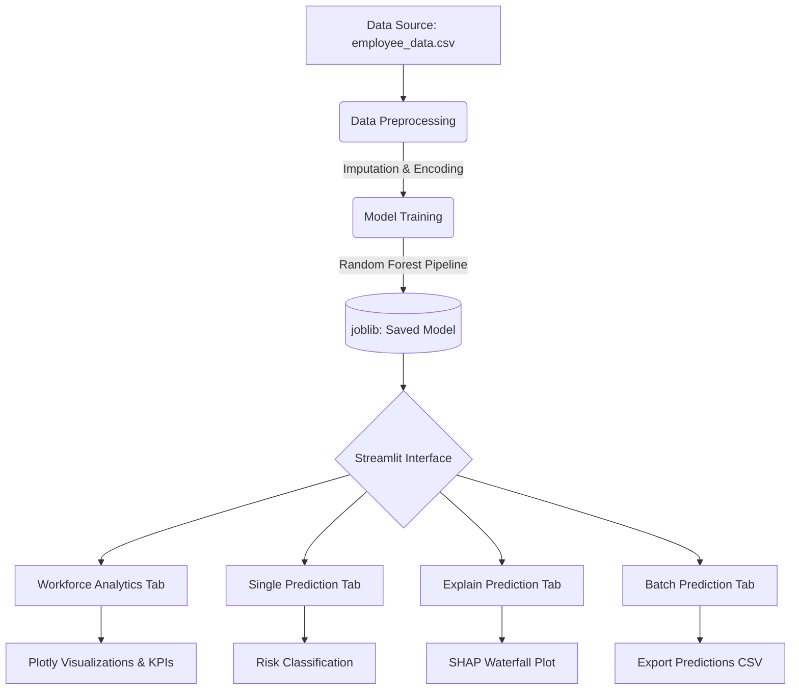

# 💼 Employee Attrition Predictor & Workforce Analytics


An executive-level Human Resources analytics platform powered by Machine Learning. This application uses a Random Forest pipeline to predict employee attrition, provides deep organizational insights through interactive dashboards, and transparently explains its AI decisions using SHAP (SHapley Additive exPlanations).

---

## 📑 Table of Contents
1. [Features](#-features)
2. [Project Architecture](#-project-architecture)
3. [Technology Stack](#-technology-stack)
4. [Folder Structure](#-folder-structure)
5. [Model Performance](#-model-performance)
6. [Installation Guide](#-installation-guide)
7. [Usage Guide](#-usage-guide)
8. [Screenshots](#-screenshots)
9. [Future Enhancements](#-future-enhancements)

---

## 🌟 Features

- **Workforce Analytics Dashboard:** Executive KPIs, automated AI insights, and dynamic cross-filtered Plotly charts (Department, Salary, Promotion, Satisfaction, Tenure, and Risk analytics).
- **Single Employee Prediction:** Real-time prediction form for prospective or current employees to gauge their attrition probability and risk classification (Low, Medium, High).
- **Explainable AI (XAI):** Integrated SHAP Waterfall plots that transparently explain *why* the model made a specific prediction on a feature-by-feature basis.
- **Batch Processing:** Upload a CSV file of your workforce to score hundreds of employees instantly and export the predictions.
- **Automated Preprocessing:** Scikit-learn `ColumnTransformer` handles categorical encoding and missing value imputation on the fly.

---

## 🏗️ Project Architecture



---

## 💻 Technology Stack

- **Frontend & App Framework:** Streamlit
- **Data Manipulation:** Pandas, NumPy
- **Machine Learning:** Scikit-learn (Random Forest, ColumnTransformer, Pipeline)
- **Explainable AI (XAI):** SHAP (SHapley Additive exPlanations)
- **Data Visualization:** Plotly, Matplotlib
- **Serialization:** Joblib

---

## 📁 Folder Structure

```text
Employee-Attrition-AI/
├── app/
│   └── app.py                      # Main Streamlit application
├── data/
│   └── employee_data.csv           # Historical employee dataset
├── models/
│   ├── attrition_rf_pipeline.joblib# Trained ML pipeline
│   └── evaluation_metrics.json     # Saved test performance metrics
├── src/
│   ├── data_preprocessing.py       # Data cleaning, splitting, and pipeline defs
│   ├── train_model.py              # Script to train and save the ML model
│   └── predict.py                  # CLI inference and prediction logic
├── requirements.txt                # Python dependencies
└── README.md                       # Project documentation
```

---

## 📊 Model Performance

The Random Forest model was thoroughly cross-validated and achieved exceptional results on the held-out test set:

- **Test Accuracy:** ~98.1%
- **Test F1 Score (Weighted):** ~98.1%
- **Test ROC AUC:** ~98.2%

*Note: Detailed metrics are accessible dynamically within the Streamlit dashboard.*

---

## 🛠️ Installation Guide

### Prerequisites
- Python 3.11+
- Git

### Steps

1. **Clone the repository:**
   ```bash
   git clone https://github.com/yourusername/Employee-Attrition-AI.git
   cd Employee-Attrition-AI
   ```

2. **Create and activate a virtual environment (Optional but recommended):**
   ```bash
   # Windows
   python -m venv venv
   venv\Scripts\activate
   
   # Mac/Linux
   python3 -m venv venv
   source venv/bin/activate
   ```

3. **Install dependencies:**
   ```bash
   pip install -r requirements.txt
   pip install shap matplotlib plotly streamlit pandas scikit-learn
   ```

---

## 🚀 Usage Guide

### Running the Dashboard
To launch the interactive Workforce Analytics platform:
```bash
streamlit run app/app.py
```
The application will open in your default browser at `http://localhost:8501`.

### Command Line Interface (CLI)
You can also run batch or interactive predictions straight from the terminal without launching the UI:
```bash
# Interactive REPL mode
python src/predict.py

# Batch processing
python src/predict.py --input-csv data/new_hires.csv --output-csv predictions.csv
```

---

## 📸 Screenshots

*(Replace these placeholder links with actual screenshots of your running application)*

### Workforce Analytics Dashboard


### Explainable AI (SHAP Waterfall)


### Single Prediction Form


---

## 🔮 Future Enhancements

- **Time-Series Analysis:** Incorporate historical promotion velocity data to predict exact timelines for expected attrition.
- **Automated Retraining:** Create an Airflow DAG or GitHub Action to retrain the pipeline when new HR data is added to the system.
- **Database Integration:** Connect the Streamlit dashboard directly to a live PostgreSQL or Snowflake HR database instead of reading static CSVs.
- **Ordinal Encoding Integration:** Upgrade the `ColumnTransformer` to use `OrdinalEncoder` for the Salary feature rather than one-hot encoding, respecting its natural hierarchy (low < medium < high).
