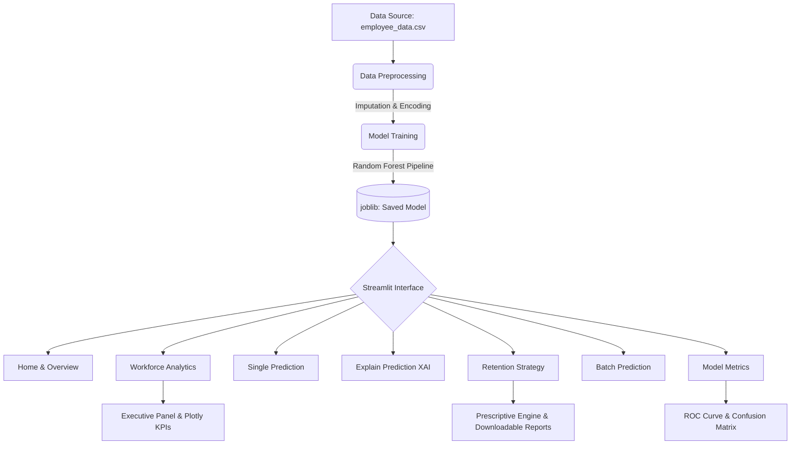
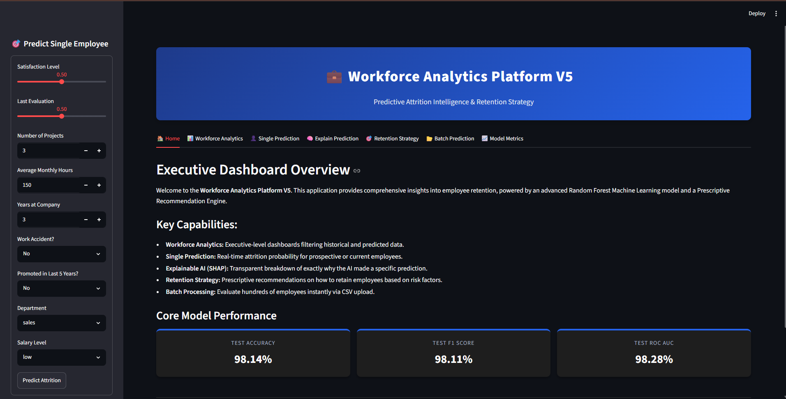
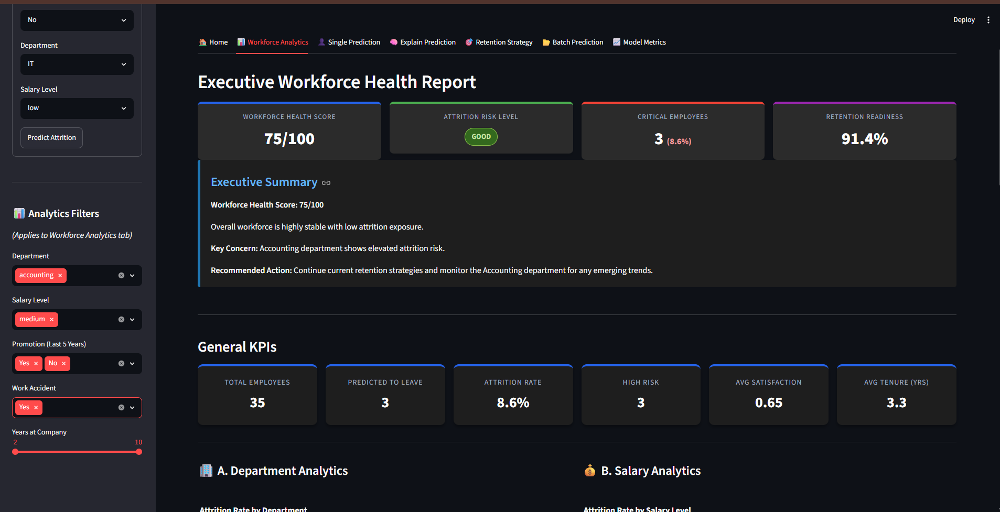
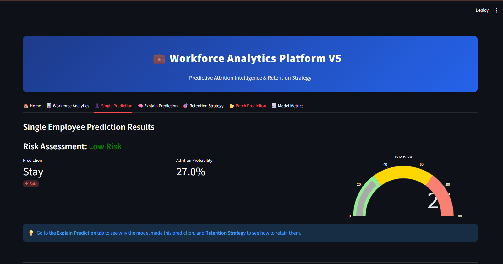
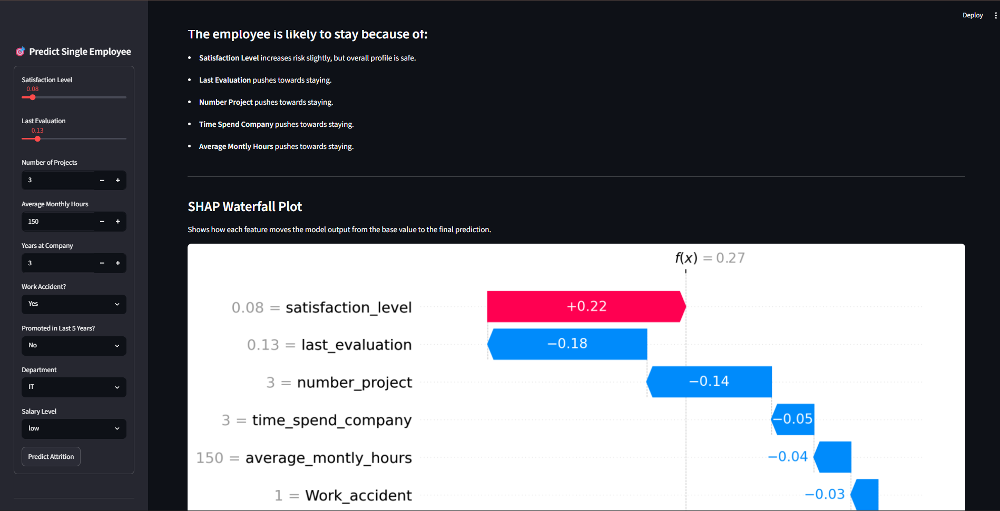
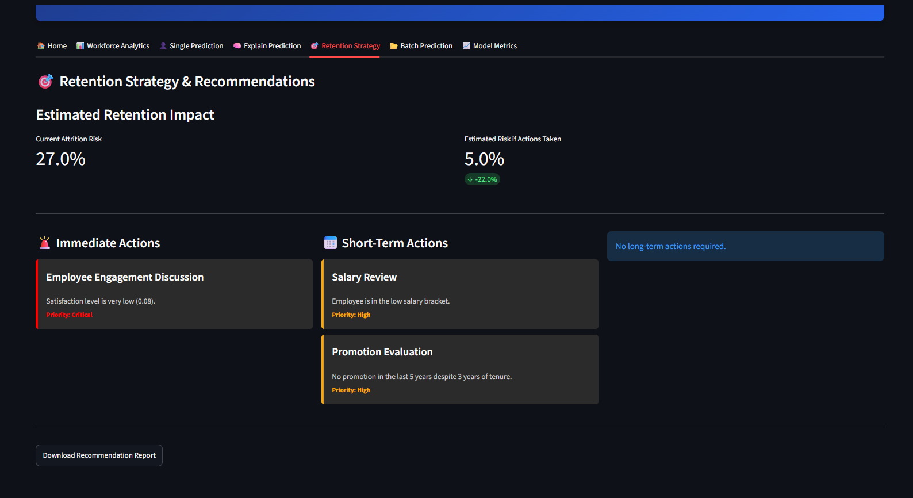
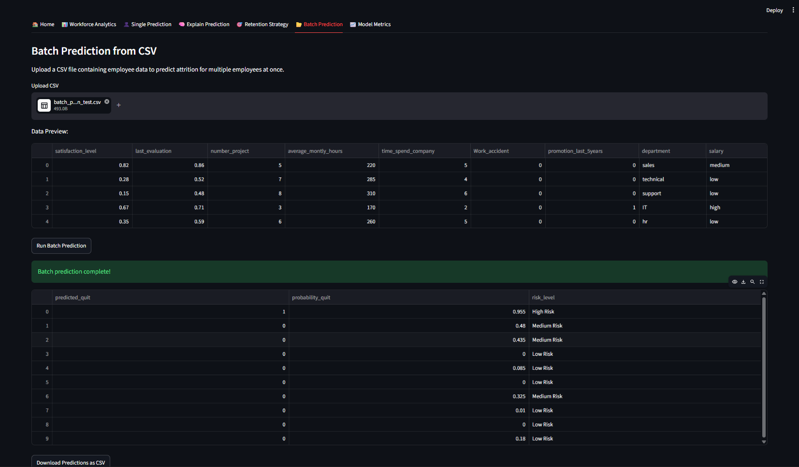
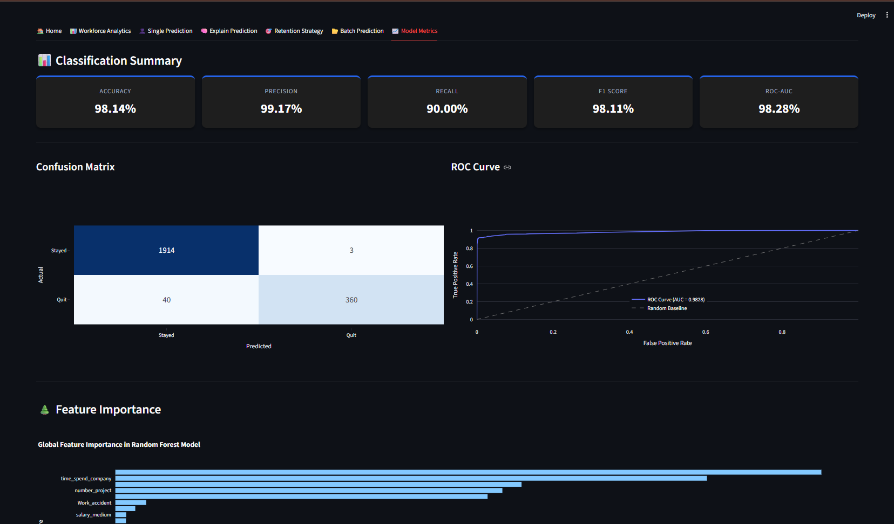

# 💼 Employee Attrition Predictor & Workforce Analytics (V5)


An executive-level Human Resources analytics platform powered by Machine Learning. This application uses a robust Random Forest pipeline to predict employee attrition, provides deep organizational insights through interactive dashboards, and transparently explains its AI decisions using SHAP (SHapley Additive exPlanations). Version 5.0 introduces prescriptive retention recommendations and a comprehensive executive health score panel.

---

## 🏆 Key Achievements
- **98%+ Accuracy:** Highly precise machine learning pipeline minimizing false positives.
- **SHAP Explainability:** Transparent AI decisions demystifying the "black box" of predictive modeling.
- **Workforce Analytics:** Interactive, cross-filtered dashboards highlighting systemic organizational risks.
- **Prescriptive Recommendations:** Actionable, customized retention strategies generated for at-risk employees.
- **Batch Processing:** Ability to seamlessly score hundreds of employees instantly.
- **Executive Dashboard:** High-level workforce health scores and automated text-based summaries.

---

## 📑 Table of Contents
1. [Project Highlights](#-project-highlights)
2. [Business Impact](#-business-impact)
3. [Features](#-features)
4. [Project Architecture](#-project-architecture)
5. [Technology Stack](#-technology-stack)
6. [Folder Structure](#-folder-structure)
7. [Model Performance](#-model-performance)
8. [Installation Guide](#-installation-guide)
9. [Usage Guide](#-usage-guide)
10. [Screenshots](#-screenshots)
11. [Future Enhancements](#-future-enhancements)

---

## 🚀 Project Highlights
- **End-to-End ML Pipeline:** Seamless integration from data preprocessing (`ColumnTransformer`) to model inference and web deployment.
- **Action-Oriented AI:** Moves beyond mere prediction by offering a *Prescriptive Engine* that calculates the estimated impact of proposed HR interventions.
- **Production-Ready UI:** Professional, custom-styled Streamlit interface tailored for executive stakeholders and HR teams.

---

## 💡 Business Impact
High employee turnover costs organizations significantly in recruitment, onboarding, and lost productivity. This tool allows HR departments to transition from a **reactive** stance (conducting exit interviews) to a **proactive** strategy (intervening before an employee leaves). By identifying key drivers of dissatisfaction and providing concrete retention plans, this platform can directly reduce turnover rates and save capital.

---

## 🌟 Features

- **Executive Summary Panel:** High-level overview displaying the Workforce Health Score, Attrition Risk Level, and dynamically generated summary text.
- **Workforce Analytics Dashboard:** Executive KPIs, automated AI insights, and dynamic cross-filtered Plotly charts (Department, Salary, Promotion, Satisfaction, Tenure, and Risk analytics).
- **Single Employee Prediction:** Real-time prediction form for prospective or current employees to gauge their attrition probability and risk classification.
- **SHAP Explainable AI:** Integrated SHAP Waterfall plots that transparently explain *why* the model made a specific prediction on a feature-by-feature basis.
- **Retention Recommendation Engine:** Prescriptive, tiered (Immediate, Short-Term, Long-Term) action plans to retain high-risk employees, complete with downloadable markdown reports.
- **Batch Prediction:** Upload a CSV file of your workforce to score hundreds of employees instantly and export the predictions.
- **Comprehensive Model Metrics:** Detailed performance tracking including Confusion Matrix, ROC Curve, and Feature Importance Analysis.
- **Automated Preprocessing:** Scikit-learn handles categorical encoding and missing value imputation on the fly.

---

## 🏗️ Project Architecture



---

## 💻 Technology Stack

- **Frontend & App Framework:** Streamlit
- **Data Manipulation:** Pandas, NumPy
- **Machine Learning:** Scikit-learn (Random Forest, ColumnTransformer, Pipeline)
- **Explainable AI (XAI):** SHAP (SHapley Additive exPlanations)
- **Data Visualization:** Plotly, Matplotlib
- **Serialization:** Joblib

---

## 📁 Folder Structure

```text
Employee-Attrition-AI/
├── app/
│   ├── app.py                      # Main Streamlit application
│   └── prescriptive_engine.py      # Logic for retention recommendations
├── data/
│   └── employee_data.csv           # Historical employee dataset
├── models/
│   ├── attrition_rf_pipeline.joblib# Trained ML pipeline
│   └── evaluation_metrics.json     # Saved test performance metrics
├── src/
│   ├── data_preprocessing.py       # Data cleaning, splitting, and pipeline defs
│   ├── train_model.py              # Script to train and save the ML model
│   └── predict.py                  # CLI inference and batch prediction logic
├── requirements.txt                # Python dependencies
└── README.md                       # Project documentation
```

---

## 📊 Model Performance

The Random Forest model was thoroughly cross-validated and achieved exceptional results on the held-out test set:

- **Test Accuracy:** ~98.1%
- **Test F1 Score (Weighted):** ~98.1%
- **Test ROC AUC:** ~98.2%

*Note: Detailed metrics, ROC curves, and Feature Importance charts are accessible dynamically within the 'Model Metrics' tab of the dashboard.*

---

## 🛠️ Installation Guide

### Prerequisites
- Python 3.11+
- Git

### Steps

1. **Clone the repository:**
   ```bash
   git clone https://github.com/yourusername/Employee-Attrition-AI.git
   cd Employee-Attrition-AI
   ```

2. **Create and activate a virtual environment (Optional but recommended):**
   ```bash
   # Windows
   python -m venv venv
   venv\Scripts\activate
   
   # Mac/Linux
   python3 -m venv venv
   source venv/bin/activate
   ```

3. **Install dependencies:**
   ```bash
   pip install -r requirements.txt
   pip install shap matplotlib plotly streamlit pandas scikit-learn
   ```

---

## 🚀 Usage Guide

### Running the Dashboard
To launch the interactive Workforce Analytics platform:
```bash
streamlit run app/app.py
```
The application will open in your default browser at `http://localhost:8501`.

### Command Line Interface (CLI)
You can also run batch or interactive predictions straight from the terminal without launching the UI:
```bash
# Interactive REPL mode
python src/predict.py

# Batch processing
python src/predict.py --input-csv data/new_hires.csv --output-csv predictions.csv
```

---

## 📸 Screenshots

*Ensure screenshots are captured and placed in the `assets/screenshots/` directory.*

### Home Dashboard


### Workforce Analytics & Executive Summary


### Single Prediction


### Explainable AI (SHAP)


### Retention Strategy


### Batch Prediction


### Model Metrics (ROC Curve & Confusion Matrix)


---

## 🔮 Future Enhancements

- **Time-Series Analysis:** Incorporate historical promotion velocity data to predict exact timelines for expected attrition.
- **Automated Retraining:** Create an Airflow DAG or GitHub Action to retrain the pipeline when new HR data is added to the system.
- **Database Integration:** Connect the Streamlit dashboard directly to a live PostgreSQL or Snowflake HR database instead of reading static CSVs.
- **Ordinal Encoding Integration:** Upgrade the `ColumnTransformer` to use `OrdinalEncoder` for the Salary feature rather than one-hot encoding, respecting its natural hierarchy.

---

<div align="center">
  <p><b>Developed by Sri Gowtham</b></p>
  <p><i>Machine Learning Intern Project</i></p>
  <p>Version 5.0</p>
</div>
